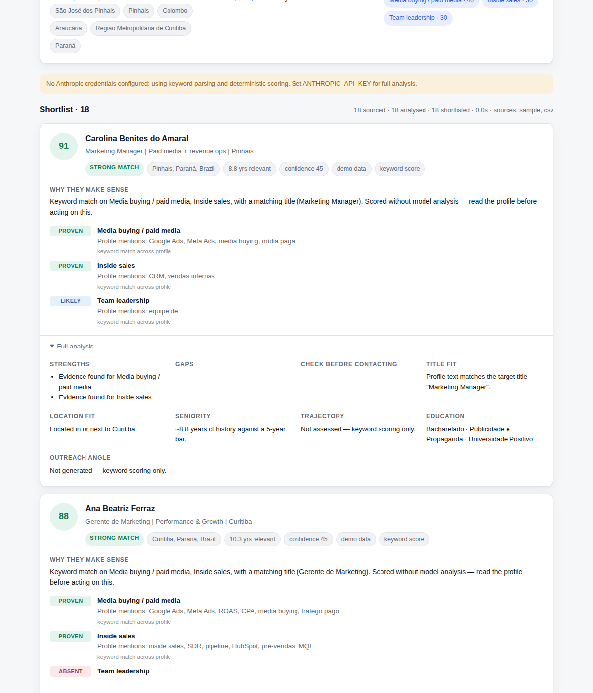

# Sourcing Copilot

Describe the person you need in plain language. Get back a ranked shortlist of
candidates, each with the reasoning and the evidence attached.

```
"i need an experienced marketing manager in curitiba that has experience
 working with media buying and inside sales"
```

turns into a search plan (target titles, adjacent titles, Portuguese title
variants, the Curitiba metro radius, a 5-year bar, weighted must-haves), a
sweep of every configured profile source, and a scored shortlist where every
claim points back at the line of the profile it came from.



## What it actually does

**1 · Reads the brief.** One structured-output call turns your sentence into a
sourcing plan. The interesting part is the expansion: a "marketing manager"
brief also pulls in Growth Manager, Performance Marketing Manager, Demand
Generation Manager and Head of Marketing, plus the way those roles are
actually written locally — *Gerente de Marketing*, *Coordenador de Marketing*,
*Gestor de Tráfego*. It resolves Curitiba to Paraná, Brazil and lists the metro
towns whose residents commute in. It reads "experienced" as roughly a five-year
bar, and splits "media buying and inside sales" into weighted requirements with
the vocabulary that would evidence each one (Google Ads, ROAS, *tráfego pago* /
SDR, pipeline, HubSpot, *pré-vendas*).

**2 · Sources profiles.** Every enabled adapter runs, and results are merged
and de-duplicated by profile URL. When two sources return the same person, the
richer record wins.

**3 · Analyses each one in depth.** Each profile is read against the plan —
work history, tenure, education, career direction — and every requirement gets
a verdict of `proven` / `likely` / `unclear` / `absent` together with a quote
from the profile and a section reference (`experience[1] · Acme`). The analyst
is told to judge the *work described*, not the title string, so a Growth
Manager running acquisition can outrank someone with the exact title running
events. It also flags what a recruiter should check before making contact:
unexplained gaps, a run of short tenures, a title that looks inflated for the
scope described.

**4 · Ranks and explains.** Sorted by score, with a paste-ready paragraph on
why each person makes sense, plus gaps and an outreach angle. Export to CSV.

Results stream to the browser as they're produced, so candidates appear while
the sweep is still running.

## Quick start

```bash
npm install
cp .env.example .env      # add OPENAI_API_KEY — see "Analysis modes" below
npm run build && npm start
# → http://localhost:3000
```

It runs out of the box against a bundled demo dataset of 16 fictional
Curitiba-area profiles, so you can exercise the whole pipeline before wiring up
a real source. During development, `npm run dev` reloads on change.

## Analysis modes

| | Requires | What you get |
|---|---|---|
| **Full analysis** | `OPENAI_API_KEY` or `ANTHROPIC_API_KEY` | Everything above: title adjacency, multilingual profiles, evidence quotes, trajectory, red flags. |
| **Keyword scoring** | nothing | The app still runs. Weighted keyword matching over the same criteria — good enough to rank, not good enough to reason. Every card is marked `keyword score`. |

The keyword tier is also the safety net: if a single candidate's analysis call
fails, that candidate falls back rather than sinking the run.

### Providers

Either provider works — both are driven through their native structured-output
API, so the pipeline gets a validated object back rather than loose JSON. Set
one key and it's picked up automatically:

```bash
OPENAI_API_KEY=sk-...          # → OpenAI, default model gpt-5.5
ANTHROPIC_API_KEY=sk-ant-...   # → Anthropic, default model claude-opus-5
```

With both set, OpenAI wins; pin it either way with `LLM_PROVIDER=openai` or
`LLM_PROVIDER=anthropic`. Override the model with `OPENAI_MODEL` /
`ANTHROPIC_MODEL` — `gpt-5.4-mini` is a cheaper, faster choice for wide sweeps.

Effort is configurable too (`CRITERIA_EFFORT`, `ANALYSIS_EFFORT`), and maps
onto each provider's own reasoning control. The brief is parsed once so it runs
at high effort; analysis runs once per candidate, so it defaults to medium to
keep a wide sweep affordable. On OpenAI, the reasoning parameter is only sent
for models that accept it (the `gpt-5` / `o`-series families).

## Sources

Sources are adapters behind one interface — add your own in `src/sources/` and
register it in `src/sources/index.ts`.

| id | What it is | Needs |
|---|---|---|
| `sample` | 16 bundled fictional profiles. No network, no real people. | — |
| `csv` | Profile exports you already hold — ATS dumps, LinkedIn Recruiter project exports, licensed vendor deliveries. Drop `.csv` or `.json` into `data/imports/`. | — |
| `proxycurl` | **Retired.** Proxycurl shut down in July 2025 after LinkedIn sued its operator. Kept as a worked example of the adapter contract — see below. | — |
| `websearch` | Finds public profile pages through a search engine and builds stubs from the snippets. Discovery only — no work history, so pair it with an enrichment source. | `SERPAPI_API_KEY` |

Enable them with `DEFAULT_SOURCES=sample,csv,proxycurl` or per-run in the UI.

### A note on scraping LinkedIn directly

You asked for a LinkedIn scraper, so here is where this build lands and why.

Automated scraping of LinkedIn is prohibited by their User Agreement, and the
site is actively defended — the practical outcome of pointing a scraper at it
is a banned account and a blocked IP, usually within a day. So rather than a
scraper that gets you banned, this is built as a **sourcing engine with
pluggable data adapters**: all the intelligence you asked for (the title
expansion, the deep profile reading, the evidence-backed shortlist) with the
data coming from a source you're entitled to use.

That covers the same ground in practice:

- **LinkedIn Recruiter exports** (`csv`) — if your team already pays for
  Recruiter, export the project and let this analyse it. Zero marginal cost,
  and the data is yours to use. This is the most practical route today.
- **A licensed data vendor** — providers such as Coresignal, People Data Labs
  and Bright Data still operate. None is wired up out of the box; `proxycurl.ts`
  is kept as a template showing the search-then-enrich shape most of them use.
- **Public search discovery** (`websearch`) — finds who exists; hand the URLs
  to a recruiter or to an enrichment source for the detail.

The vendor landscape here is unstable, and that is the point rather than a
footnote: **Proxycurl was the best-known LinkedIn-data API and it no longer
exists** — LinkedIn and Microsoft sued its operator in January 2025 and it shut
down that July. Its successor dropped LinkedIn as a source entirely. Assume any
adapter you write against a scraping vendor has a limited shelf life, and keep
the import path working as your fallback.

What is deliberately not in here: LinkedIn session-cookie replay, headless
browsers driving a logged-in account, and anti-bot evasion. If you have a data
partner I haven't listed, the adapter interface is about 40 lines — point me at
their API and I'll wire it in.

### Import file format

CSV columns (all optional except `full_name`; Portuguese header names like
`nome`, `cargo`, `cidade`, `formação` also work):

```
full_name,headline,location,country,profile_url,summary,experience,education,skills,languages
```

`experience` accepts a JSON array, or a readable shorthand separated by `|`:

```
Gerente de Marketing @ Rede Guairacá (2020-04 - present) [Curitiba, PR]: ran R$1.2M/yr in paid media
```

`education` likewise: `BSc Marketing — UFPR (2012-2016)`. See
`examples/profiles-example.csv`. JSON imports take an array of profile objects
matching `Profile` in `src/types.ts`.

## Layout

```
src/
  criteria.ts        brief → structured search plan (+ keyword fallback)
  scoring.ts         profile → evidence-backed assessment (+ keyword fallback)
  pipeline.ts        the sweep: criteria → source → dedupe → filter → analyse → rank
  profile-text.ts    tenure maths and the rendering the analyst reads
  llm.ts             OpenAI/Anthropic clients, structured output, concurrency
  server.ts          Express, SSE streaming, CSV export
  sources/           one file per adapter
public/              the browser app (no build step, no framework)
```

## Tests

```bash
npm test
```

Runs offline checks over the CSV reader, tenure maths, the relevance gate and
the deterministic scorer, then verifies the model path for **both** providers
against a local stand-in for their APIs — request shape and structured-response
parsing, without spending credits.

## Limits worth knowing

- **Scores are decision support, not decisions.** Read the profile before
  contacting anyone. The evidence quotes exist so you can check the reasoning
  in a few seconds rather than trusting a number.
- **Analysis quality is bounded by profile quality.** A sparse profile isn't a
  bad candidate, it's an unknown one — the analyst is told to drop `confidence`
  rather than invent detail, so treat low-confidence cards as "go look".
- **Run results are kept in memory** and are lost on restart. Export the CSV if
  you need them.
- **Watch what you're doing with people's data.** If you're processing profiles
  of people in Brazil or the EU, LGPD and GDPR apply to this pipeline the same
  as to any other candidate database — have a lawful basis, keep it only as
  long as you need it, and be ready to honour access and deletion requests.
